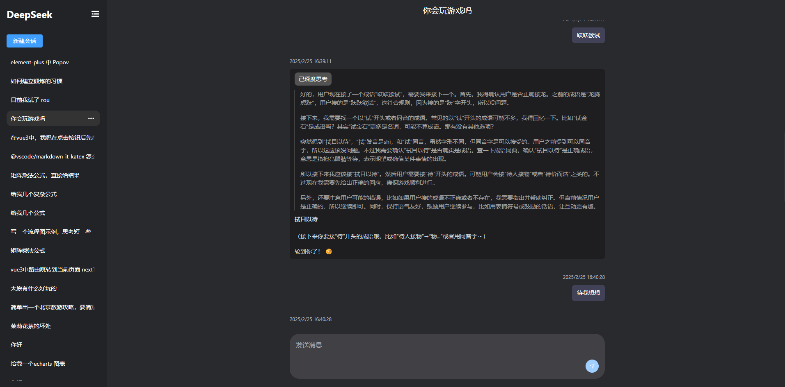

### 介绍

仿deepSeek 简易对话聊天, 基于vue3、ts、vite、element-plus unocss

<!-- 引入图片 -->
<!-- 图片左右排列 -->


### 功能点

- 支持多轮对话
- SSE流式输出
- 流式输出中用户手动中断
- 流式输出页面自动滚动
- 流式输出闪烁下划线
- 支持数学公式
- 代码块高亮 复制
- 主题

### 项目运行

```bash
pnpm install
pnpm dev
```

### 配置

```bash
// 测试使用阿里云大模型  .env 配置key 和 地址
VITE_APP_API_BASE_URL=https://dashscope.aliyuncs.com
VITE_APP_API_KEY=sk-************************
```

### 演示图





参考 <https://github.com/Chanzhaoyu/chatgpt-web>
